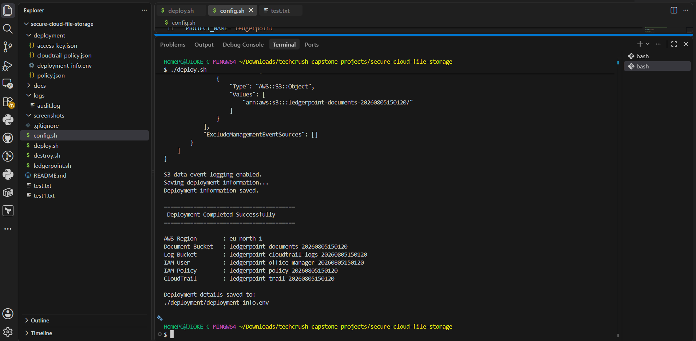
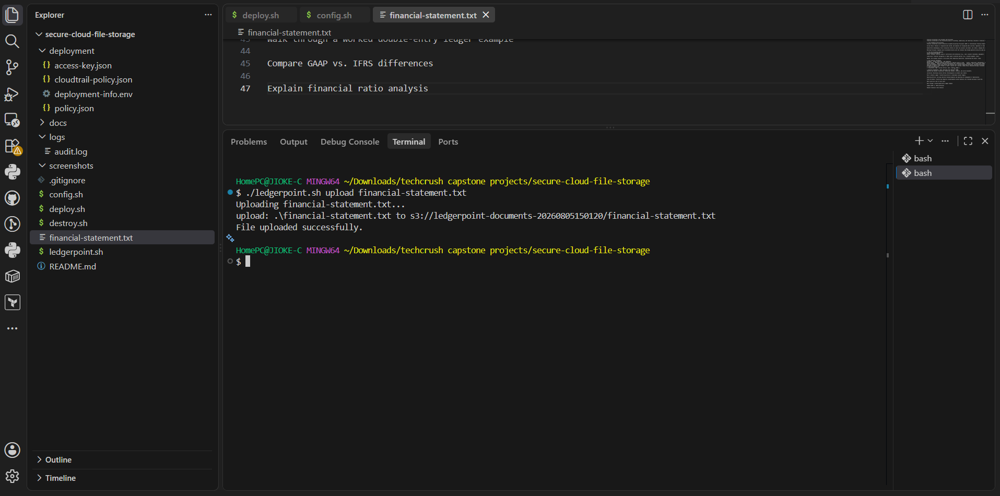
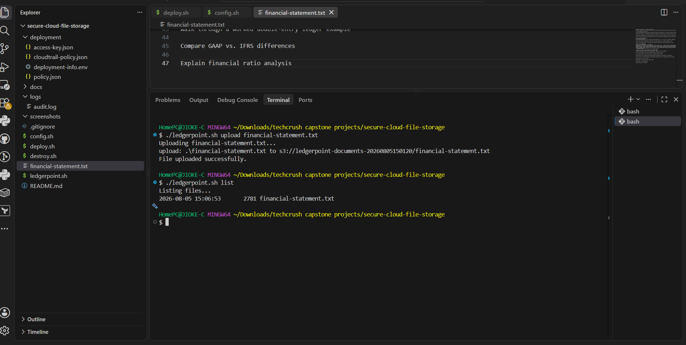
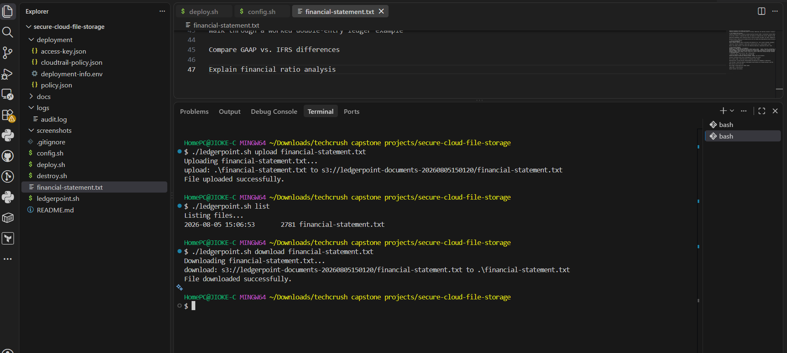
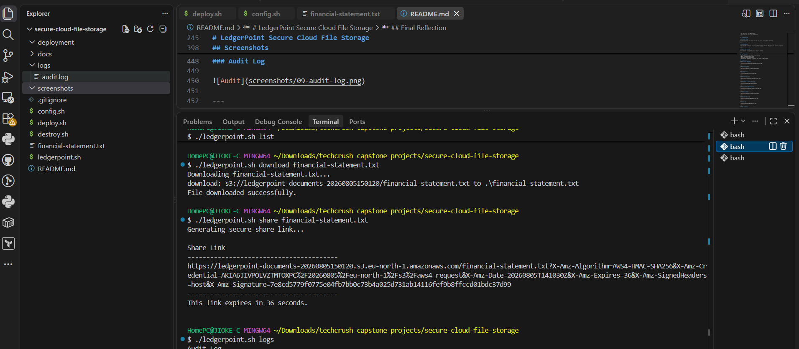
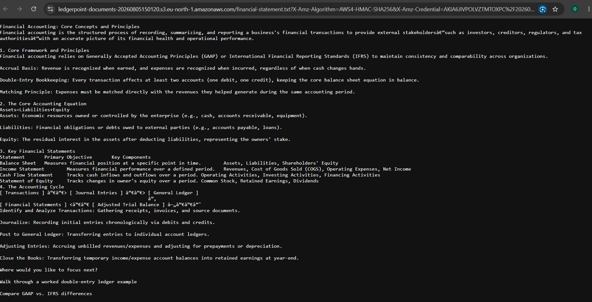
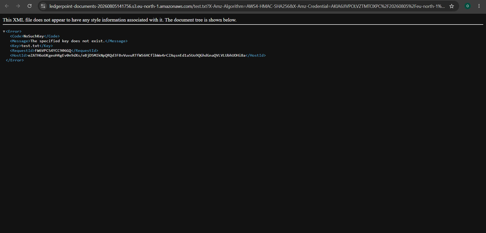
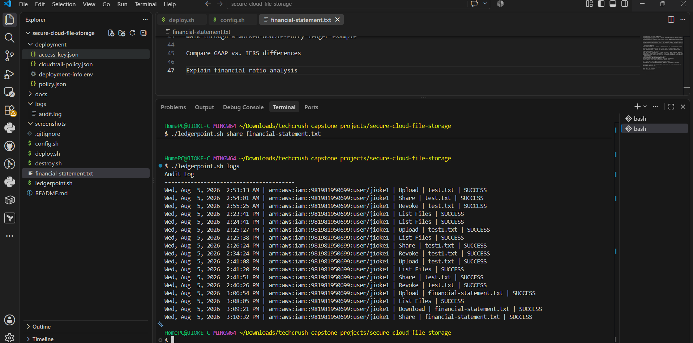
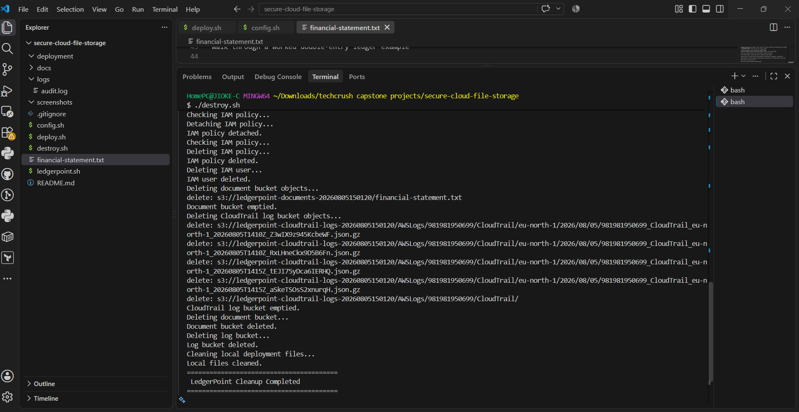

# LedgerPoint Secure Cloud File Storage System

## Project Overview

LedgerPoint Secure Cloud File Storage System is a secure cloud-based file management solution built on Amazon Web Services (AWS). The system enables internal staff to upload, download, list, share, and revoke access to sensitive financial documents through a simple Bash command-line interface.

The solution was designed to meet LedgerPoint's requirement for secure temporary file sharing with external auditors without requiring user accounts. Instead of exposing files publicly, the system generates time-limited Amazon S3 pre-signed URLs that automatically expire after a configurable duration.

To improve accountability, every file operation is recorded in a local audit log while AWS CloudTrail captures cloud API activity for additional auditing.

## Client Scenario

LedgerPoint is a boutique accounting firm that regularly exchanges confidential financial statements with external auditors.

The firm required a secure and low-cost solution that allows:

- Internal staff to upload client documents.
- External auditors to access documents without creating AWS accounts.
- Shared links to expire automatically.
- Files to remain private by default.
- Every action to be logged for auditing purposes.
- Simple operation by a non-technical office manager.

## Objectives

The project was designed to:

- Securely store confidential financial documents.
- Keep Amazon S3 buckets private by default.
- Generate temporary share links using pre-signed URLs.
- Revoke access by replacing the shared object.
- Record all file operations in an audit log.
- Automate deployment and cleanup using Bash scripts

 Local audit.log and AWS CloudTrail | System Administrator |

## Screenshots

### Successful Deployment

---

### Uploading a File

---

### Listing Files

---

### Downloading a File

---

### Generating a Secure Share Link

---

### Accessing the Shared Document

---

### Revoking Access

---

### Expired Share Link

---

### Audit Log

---

### Resource Cleanup

## Final Reflection

This project demonstrates the implementation of a secure cloud file storage solution using Amazon Web Services (AWS). It focuses on secure document sharing, least-privilege access control, temporary external access using Amazon S3 pre-signed URLs, audit logging, and infrastructure automation through Bash scripting.

## Author

Chijioke Odoh